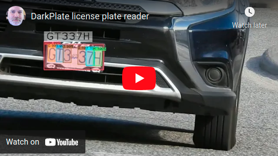

# DarkPlate

[](https://www.youtube.com/watch?v=vz2wr66J020)

Note that DarkPlate by itself is not a complete software project.  The intended purpose was to create a simple project showing how to use Darknet/YOLO, DarkHelp, and OpenCV to find license plates, parse them, and display the results.

## Dependencies

The 3 dependencies are:

- OpenCV (image processing library)
- Darknet (neural network framework for YOLO)
- DarkHelp (C++ API wrapper for Darknet)

Installing these is explained on the DarkHelp repo: https://github.com/stephanecharette/DarkHelp#building-darknet

## Build and run

Once the dependencies have been installed, run the following commands to build and run DarkPlate on Ubuntu:

```
mkdir -p ~/src
cd ~/src
git clone https://github.com/stephanecharette/DarkPlate
cd DarkPlate
mkdir build
cd build
cmake -DCMAKE_BUILD_TYPE=Release ..
make
src/DarkPlate ../media/m1.mp4
```

